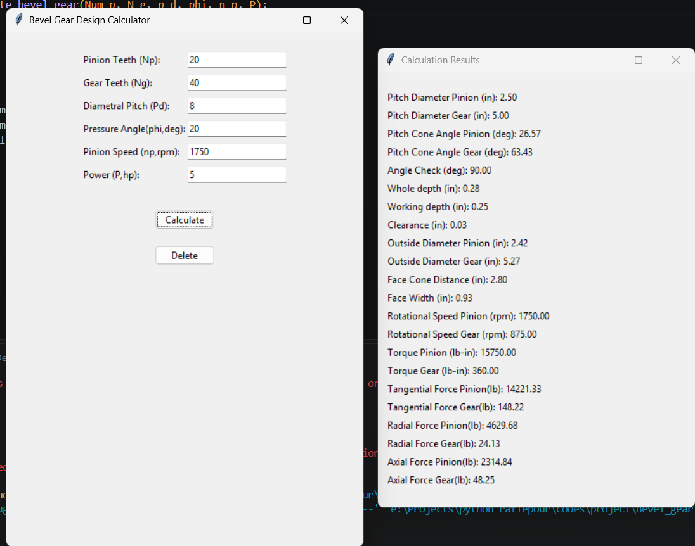

# Bevel Gear Design Calculator



A Python-based engineering calculator for the preliminary design and analysis of bevel gears.

## About the Project

This project was developed to automate several engineering calculations related to bevel gear design.

The program provides a simple graphical user interface (GUI) where the user can enter the main design parameters and obtain calculated gear geometry, speed, torque, and forces.

## Input Parameters

The program uses the following inputs:

* Pinion teeth
* Gear teeth
* Diametral pitch
* Pressure angle
* Pinion speed
* Power

## Calculations

The program calculates several bevel gear parameters, including:

* Pitch diameters
* Pitch cone angles
* Gear ratio
* Gear rotational speed
* Whole depth
* Working depth
* Clearance
* Outside diameters
* Face cone distance
* Face width
* Torque
* Tangential force
* Radial force
* Axial force

## Technologies Used

* Python
* Tkinter
* SQLite
* CSV
* Mathematical and engineering calculations

## Example Input

```text
Pinion Teeth: 20
Gear Teeth: 40
Diametral Pitch: 8
Pressure Angle: 20°
Pinion Speed: 1750 RPM
Power: 5 HP
```

For this example:

```text
Gear Ratio = 2:1
Gear Speed = 875 RPM
```

## How to Run

Make sure Python is installed.

Run the main program:

```bash
python Bevel_gear.py
```

The program will open a graphical interface where the input parameters can be entered.

## Project Purpose

The purpose of this project is to combine mechanical engineering knowledge with Python programming and engineering automation.

It demonstrates the use of programming to automate repetitive mechanical design calculations.

## Future Improvements

Possible future improvements include:

* Additional bevel gear design calculations
* Improved engineering validation
* Result visualization
* CAD integration
* CAE workflow integration
* Automated design optimization

## Author

**Aryan Shahrabi Farahani**

Mechanical Engineering
Python | Mechanical Design | CAE | Engineering Automation
